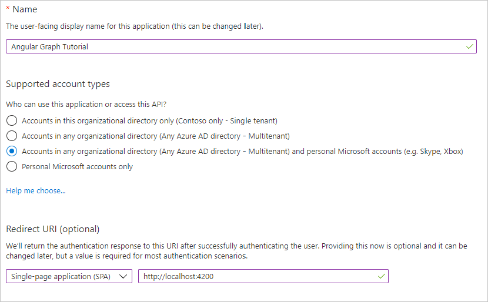

<!-- markdownlint-disable MD002 MD041 -->

В этом упражнении будет создаваться новая регистрация веб-приложений Azure AD с помощью центра администрирования Azure Active Directory.

1. Откройте браузер и перейдите в [Центр администрирования Azure Active Directory](https://aad.portal.azure.com). Войдите с помощью **личной учетной записи** (т.е. учетной записи Microsoft) или **рабочей (учебной) учетной записи**.

1. Выберите **Azure Active Directory** на панели навигации слева, затем выберите **Регистрация приложений** в разделе **Управление**.

    

1. Выберите **Новая регистрация**. На странице **Зарегистрировать приложение** задайте необходимые значения следующим образом.

    - Введите **имя** `Angular Graph Tutorial`.
    - Введите **поддерживаемые типы учетных записей** для **учетных записей в любом каталоге организаций и личных учетных записей Microsoft**.
    - В разделе **URI адрес перенаправления** введите значение в первом раскрывающемся списке `Single-page application (SPA)` и задайте значение `http://localhost:4200`.

    

1. Нажмите **Зарегистрировать**. На странице **Учебник по** угловому графику скопируйте значение ID приложения **(клиента)** и сохраните его, оно потребуется на следующем шаге.

    
