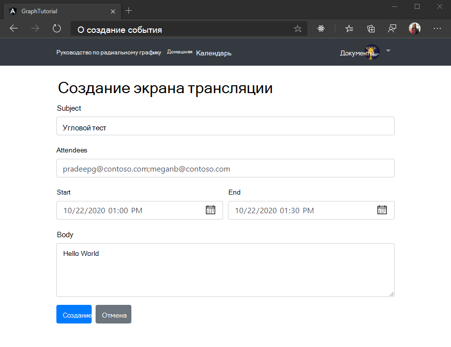

<!-- markdownlint-disable MD002 MD041 -->

<span data-ttu-id="28cef-101">В этом разделе мы добавим возможность создания событий в календаре пользователя.</span><span class="sxs-lookup"><span data-stu-id="28cef-101">In this section you will add the ability to create events on the user's calendar.</span></span>

1. <span data-ttu-id="28cef-102">Откройте **./СРК/АПП/граф.сервице.ТС** и добавьте в класс следующую функцию `GraphService` .</span><span class="sxs-lookup"><span data-stu-id="28cef-102">Open **./src/app/graph.service.ts** and add the following function to the `GraphService` class.</span></span>

    :::code language="typescript" source="../demo/graph-tutorial/src/app/graph.service.ts" id="AddEventSnippet":::

## <a name="create-a-new-event-form"></a><span data-ttu-id="28cef-103">Создание новой формы события</span><span class="sxs-lookup"><span data-stu-id="28cef-103">Create a new event form</span></span>

1. <span data-ttu-id="28cef-104">Создайте угловой компонент для отображения формы и вызова этой новой функции.</span><span class="sxs-lookup"><span data-stu-id="28cef-104">Create an Angular component to display a form and call this new function.</span></span> <span data-ttu-id="28cef-105">Выполните следующую команду в командной панели CLI.</span><span class="sxs-lookup"><span data-stu-id="28cef-105">Run the following command in your CLI.</span></span>

    ```Shell
    ng generate component new-event
    ```

1. <span data-ttu-id="28cef-106">После завершения команды добавьте компонент в `routes` массив в файле **./СРК/АПП/АПП-раутинг.модуле.ТС**.</span><span class="sxs-lookup"><span data-stu-id="28cef-106">Once the command completes, add the component to the `routes` array in **./src/app/app-routing.module.ts**.</span></span>

    ```typescript
    import { NewEventComponent } from './new-event/new-event.component';

    const routes: Routes = [
      { path: '', component: HomeComponent },
      { path: 'calendar', component: CalendarComponent },
      { path: 'newevent', component: NewEventComponent },
    ];
    ```

1. <span data-ttu-id="28cef-107">Создайте новый файл в каталоге **./СРК/АПП/Нев-Евент** с именем **New – Event. TS** и добавьте следующий код.</span><span class="sxs-lookup"><span data-stu-id="28cef-107">Create a new file in the **./src/app/new-event** directory named **new-event.ts** and add the following code.</span></span>

    :::code language="typescript" source="../demo/graph-tutorial/src/app/new-event/new-event.ts" id="NewEventSnippet":::

    <span data-ttu-id="28cef-108">Этот класс будет выступать в качестве модели для новой формы события.</span><span class="sxs-lookup"><span data-stu-id="28cef-108">This class will serve as the model for the new event form.</span></span>

1. <span data-ttu-id="28cef-109">Откройте **/СРК/АПП/Нев-Евент/Нев-Евент.компонент.ТС** и замените его содержимое приведенным ниже кодом.</span><span class="sxs-lookup"><span data-stu-id="28cef-109">Open **./src/app/new-event/new-event.component.ts** and replace its contents with the following code.</span></span>

    :::code language="typescript" source="../demo/graph-tutorial/src/app/new-event/new-event.component.ts" id="NewEventComponentSnippet":::

1. <span data-ttu-id="28cef-110">Откройте **./срк/апп/нев-евент/new-event.component.html** и замените его содержимое приведенным ниже кодом.</span><span class="sxs-lookup"><span data-stu-id="28cef-110">Open **./src/app/new-event/new-event.component.html** and replace its contents with the following code.</span></span>

    :::code language="html" source="../demo/graph-tutorial/src/app/new-event/new-event.component.html" id="NewEventFormSnippet":::

1. <span data-ttu-id="28cef-111">Сохраните изменения и обновите приложение.</span><span class="sxs-lookup"><span data-stu-id="28cef-111">Save the changes and refresh the app.</span></span> <span data-ttu-id="28cef-112">Нажмите кнопку **создать событие** на странице календаря, а затем используйте форму, чтобы создать событие в календаре пользователя.</span><span class="sxs-lookup"><span data-stu-id="28cef-112">Select the **New event** button on the calendar page, then use the form to create an event on the user's calendar.</span></span>

    
